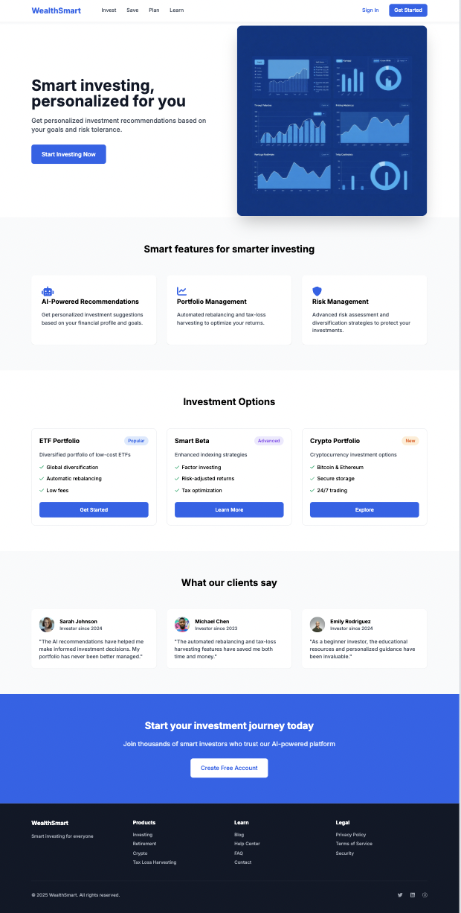

# WealthSmart: Personalized Financial Portfolio Recommendation App

## Overview
Our investment recommender system, WealthSmart, is designed to help users explore and discover financial products—stocks, ETFs, and bonds—based on their investment preferences and styles. Unlike auto-trading platforms, we do not make decisions for users; instead, we provide curated recommendations to expand their knowledge and help them make informed choices.

## Purpose and Intentions
Many investors, especially newcomers, may not be fully aware of the vast array of investment opportunities available. They may struggle to understand why certain sectors or products are gaining traction among others with similar financial goals.

Our system is built to bridge this gap by answering key questions:
- **What are investors with similar styles and risk tolerances exploring?**
- **Which investments have they found to be valuable or satisfying?**
- **How can users discover new sectors or products that align with their goals?**

Much like how Spotify’s “Discover Weekly” introduces users to new music based on their listening habits, our system introduces users to investments they might find interesting based on the habits of similar investors. This approach sparks curiosity, encourages diversification, and fosters a deeper understanding of financial markets.

## How It Works
We utilize **User-Based Collaborative Filtering**, which identifies investors with similar preferences and recommends financial products that have been positively received by those with comparable investment behaviors. This method helps users uncover new opportunities they might not have considered, empowering them to broaden their investment strategies.

## User Responsibility
WealthSmart does **not** promise the highest returns or dictate financial decisions. Instead, it serves as a tool for discovery and learning. Since long-term portfolio performance depends on multiple factors—including market trends, holding periods, and company performance—users must conduct their own research, assess value and risks, and make independent investment choices.

## Conclusion
Our goal is simple: **help users explore more, learn more, and invest smarter.** By introducing them to sectors and products that align with their investment style, we provide a gateway to better decision-making and a broader financial perspective.

## 📌 Project Documentation

📖 Read the full methodology on **Notion**:  
👉 [Building a Personalized Investment Recommender System](https://kayleecho.notion.site/Building-a-Personalized-Investment-Recommender-System-Methods-and-Approach-1af19e5308e180bf8c9ae6adcccff307?pvs=4)

📄 View the regularly updated case study document:  
👉 [Case Study & Ideation](https://docs.google.com/document/d/1zeiNiwFU4kSNfmE-nxlwG8n7TM3ENcdJbuHo4zJD8ck/edit?usp=sharing)

## Sample Input Data (JSON Format)

```json
[
    {
      "user_id": 1,
      "investment_goal_weights": {
        "long_term_growth": 0.40,
        "stable_income": 0.10,
        "balanced_approach": 0.40,
        "high_risk_high_reward": 0.05,
        "short_term_trading": 0.05
      },
      "risk_tolerance": 7.50,
      "holding_period": {
        "response": 6.67,
        "reaction_strength": 7.00
      },
      "expected_return_score": 8.50,
      "product_preference": {
        "equities": 40,
        "government_bonds": 20,
        "corporate_bonds": 15,
        "municipal_bonds": 5,
        "savings_bonds": 5,
        "derivatives": 10,
        "alternative_investments": 5
      },
      "factor_weights": {
        "investment_goals": 25,
        "risk_tolerance": 20,
        "holding_period": 15,
        "return_score": 15,
        "product_preference": 15,
      }
    },
    {
      "user_id": 2,
      "investment_goal_weights": {
        "long_term_growth": 0.70,
        "stable_income": 0.10,
        "balanced_approach": 0.10,
        "high_risk_high_reward": 0.05,
        "short_term_trading": 0.05
      },
      "risk_tolerance": 6.25,
      "holding_period": {
        "response": 10.00,
        "reaction_strength": 8.50
      },
      "expected_return_score": 7.25,
      "product_preference": {
        "equities": 50,
        "government_bonds": 10,
        "corporate_bonds": 10,
        "municipal_bonds": 5,
        "savings_bonds": 5,
        "derivatives": 10,
        "alternative_investments": 10
      },
      "factor_weights": {
        "investment_goals": 30,
        "risk_tolerance": 20,
        "holding_period": 20,
        "return_score": 10,
        "product_preference": 10,
      }
    },
    {
      "user_id": 3,
      "investment_goal_weights": {
        "long_term_growth": 0.10,
        "stable_income": 0.10,
        "balanced_approach": 0.20,
        "high_risk_high_reward": 0.50,
        "short_term_trading": 0.10
      },
      "risk_tolerance": 8.75,
      "holding_period": {
        "response": 3.33,
        "reaction_strength": 5.00
      },
      "expected_return_score": 9.00,
      "product_preference": {
        "equities": 30,
        "government_bonds": 15,
        "corporate_bonds": 15,
        "municipal_bonds": 10,
        "savings_bonds": 10,
        "derivatives": 15,
        "alternative_investments": 15
      },
      "factor_weights": {
        "investment_goals": 20,
        "risk_tolerance": 25,
        "holding_period": 15,
        "return_score": 20,
        "product_preference": 10
      }
    }
]
```
